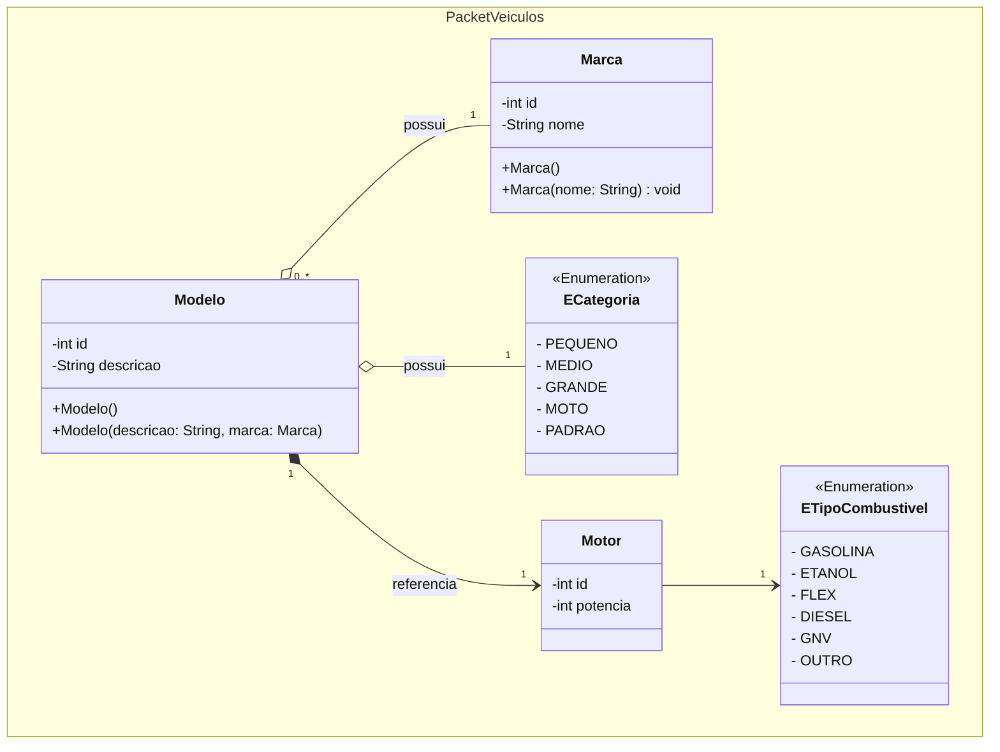
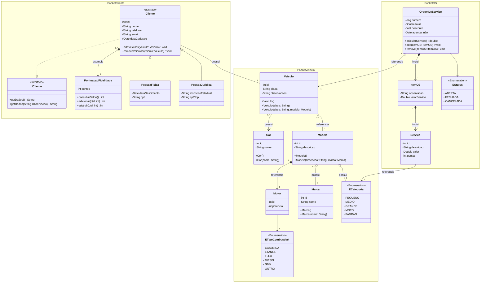

<div align="center">

</div>
<h1 align="center"> lavaCode </h1>
<p align="center">

</p>

## 📱 Projeto Sistema de Controle de Lavação utilizando API REST com Spring Boot 


### Descrição do Projeto

Este projeto tem como objetivo desenvolver um sistema que disponibilizará uma API Rest de lavação de carros. Este projeto foi criado com APIs REST, persistência com JPA, e a integração de Spring Boot com MySQL, Lombok, Maven, JUnit e utilizacao de designer pattner com as melhores praticas de programacao.

> Este projeto é apenas para fins educacionais.

CRUD com banco de dados

A partir dos exemplos produzidos em aula e do seguinte diagrama  de classes.



1. Implemente APIs e endpoints para CRUD de:
- Marca
- Modelo
- Motor

2. Forma de entrega da atividade:
- Projeto completo
- Telas capturadas do POSTMAN com todas as requisições e respostas HTTP

3. Requisições necessárias:
- __1. Marca__
   1. Listar todas
   2. Listar por ID
   3. Nova Marca
   4. Atualização
   5. Exclusão
- __2. Modelo__
  1. Listar todos, cada qual com sua Marca
  2. Listar por ID
  3. Novo Modelo
  4. Atualização
  5. Exclusão


## 📌 Funcionalidades

### Endpoints Disponíveis
1. Listar todos as marcas

GET `/marcas`
>Retorna uma lista de todas as marcas cadastradas, incluindo todos os atributos (id, nome).
2. Listar por ID

GET `/marcas/{id}`
> Retorna os detalhes de uma marca específica com base no id.

3. Adicionar uma nova marca
   
POST `/marcas`
> Adiciona uma nova marca à lista.

Exemplo do corpo da requisição (JSON):
```json
{
  "nome": "Toyota"
}
```

4. Atualiza uma marca por id 

PUT `/marcas/atualizar/{id}`
> Atualiza uma marca especifica buscada pelo id.

5. Exclui uma marca por id

DELETE `/marcas/excluir/{id}`
> Atualiza uma marca especifica buscada pelo id.


- __2. Modelo__
  1. Listar todos, cada qual com sua Marca
  2. Listar por ID
  3. Novo Modelo
  4. Atualização
  5. Exclusão

1. Listar todos as modelo e a marca

GET `/modelo`
>Retorna uma lista de todas as marcas cadastradas, incluindo todos os atributos (id, nome).
2. Listar por ID

GET `/modelo/{id}`
> Retorna os detalhes de um modelo e a marca específica com base no id.

3. Adicionar um novo modelo

POST `/modelo`
> Adiciona um novo modelo à lista.

Exemplo do corpo da requisição (JSON):
```json
{
  "descricao": "Corolla",
  "marca": { "id": 1 },
  "motor": {
    "potencia": 140,
    "tipoCombustivel": "GASOLINA"
  },
  "categoria": "MEDIO"
}
```

4. Atualiza uma marca por id

PUT `/marcas/atualizar/{id}`
> Atualiza uma marca especifica buscada pelo id.

5. Exclui uma marca por id

DELETE `/marcas/excluir/{id}`
> Atualiza uma marca especifica buscada pelo id.

Exemplos de Requisições

## 🛠 Tecnologias Utilizadas

- Java 17
- Spring Boot
- Maven
- JPA (Jakarta Persistence API): Para mapeamento objeto-relacional.
- MySQL: Banco de dados relacional para persistência dos dados.


## 🗂 Estrutura do Projeto

```bash
lavacao-api/
├── src/
│   ├── main/
│   │   ├── java/
│   │   │   └── edu/
│   │   │       └── ifsc/
│   │   │           └── lavacao_api/
│   │   │               ├── controller/
│   │   │               │   ├── Modelocontroller.java
│   │   │               │   └── Marca.java
│   │   │               ├── dto/
│   │   │               │   ├── ModeloDTO.java
│   │   │               │   └── MarcaDTO.java
│   │   │               ├── model/
│   │   │               │    └── veiculos/
│   │   │               │       ├── Modelo.java
│   │   │               │       ├── Motor.java
│   │   │               │       ├── ETipoCombustivel.java
│   │   │               │       └── Marca.java 
│   │   │               ├── repository/
│   │   │               │   ├── ModeloRepository.java
│   │   │               │   └── MarcaRepository.java 
│   │   │               ├── service/
│   │   │               │   ├── ModeloService.java
│   │   │               │   └── MarcaService.java 
│   │   │               └── LavacaoApiApplication.java
│   │   └── resources/
│   │       ├── application.properties
│   │       └── script_banco_dados.sql
│   └── test/
│       └── java/
│           └── com/
│               └── exemplo/
│                   └── livroapi/
│                       └── LavacaoApiApplicationTests.java
├── pom.xml
└── README.md
```


### Descrição dos Arquivos e Diretórios:
__controller/__

- Contém as classes responsáveis por expor os endpoints da API e lidar com as requisições HTTP.

__dto/__
- Contém as classes de transferência de dados (DTO), que definem quais atributos são retornados ou enviados em determinadas requisições.

__model/__
- Contém as classes de modelo, que representam as entidades do banco de dados.

__repository/__
`- Contém as interfaces que extendem o JpaRepository, responsáveis por interagir diretamente com o banco de dados.

__service/__
- Contém as classes de serviço que encapsulam a lógica de negócios e chamam os métodos do repositório.

__resources/__
- Contém arquivos de configuração e SQL inicial para carregar dados no banco.

__application.properties__
Configurações do Spring Boot e detalhes de conexão com o banco de dados MySQL.

__data.sql__
- Arquivo opcional para popular a tabela utilizada no projeto com dados iniciais.

__pom.xml__
- Arquivo de configuração do Maven, contendo as dependências do projeto.


### Diagrama de Classes do projeto completo (implementacao futura)

<table>
  <tr>
    <td>
      
    </td>
    <td>
      
    </td>
  </tr>
</table>

<!-- [MermaidChart: 3c7d24e8-f066-4729-bf14-ab089cf5979a] -->


<---------------------------------->

**Diagrama 1:** Diagrama de classe para o projeto Lavação.

## 📚 Aprendizados

Este projeto reforçou conhecimentos em:

- Criação de APIs REST com Spring Boot.
- Persistência de dados com JPA e MySQL.
- Integração de repositórios JPA customizados.
- Manipulação e configuração de dependências com Maven.

# Author

| [<br><sub>Carlos Hayden</sub>](https://github.com/JunhaumHayden) |
| :---: |