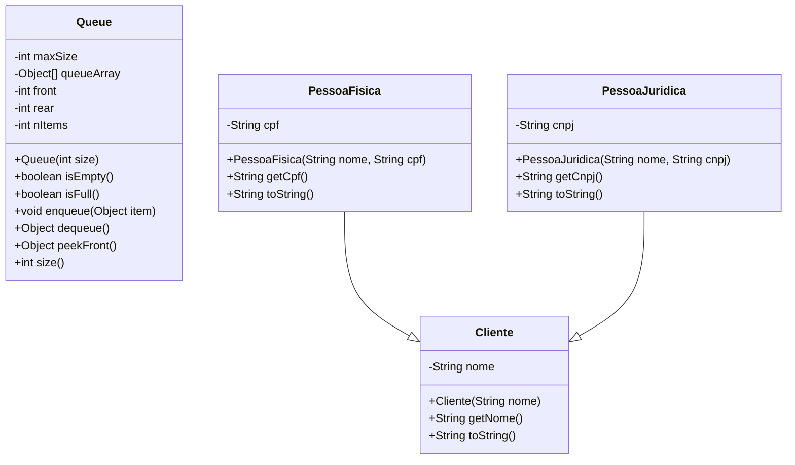

## Class Diagram

```mermaid
classDiagram
class Queue {
-int maxSize
-Object[] queueArray
-int front
-int rear
-int nItems
+Queue(int size)
+boolean isEmpty()
+boolean isFull()
+void enqueue(Object item)
+Object dequeue()
+Object peekFront()
+int size()
}

    class Cliente {
        -String nome
        +Cliente(String nome)
        +String getNome()
        +String toString()
    }

    class PessoaFisica {
        -String cpf
        +PessoaFisica(String nome, String cpf)
        +String getCpf()
        +String toString()
    }

    class PessoaJuridica {
        -String cnpj
        +PessoaJuridica(String nome, String cnpj)
        +String getCnpj()
        +String toString()
    }

    PessoaFisica --|> Cliente
    PessoaJuridica --|> Cliente
``` 
