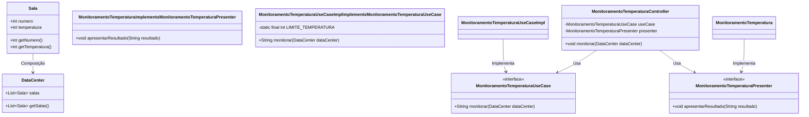

 Intermediate Princípios Básicos
## Descrição

No seu desafio, você irá implementar um sistema de monitoramento de temperatura aplicando a Clean Architecture. Cada componente do sistema deve ser criado e utilizado conforme as regras da arquitetura para garantir uma separação clara de responsabilidades. Abaixo, você encontrará o detalhamento das tarefas que devem ser realizadas. Dessa forma, o objetivo é implementar o sistema de monitoramento de temperatura seguindo a Clean Architecture. Você deve focar na criação de classes e interfaces para cada parte da arquitetura, assegurando que as responsabilidades estejam bem definidas e separadas.

Detalhamento das Tarefas:

1. Criação e execução do caso de uso: Nesta parte do código, você deve instanciar a implementação do caso de uso `MonitoramentoTemperaturaUseCaseImpl`. Esta classe contém a lógica de monitoramento de temperatura e gera os alertas se alguma sala exceder o limite.

2. Criação e execução do apresentador: Aqui, você deve instanciar o apresentador que implementa a interface `MonitoramentoTemperaturaPresenter`. Esta instância será usada pelo controlador para apresentar os resultados ao usuário.

3. Criação do controlador: Nesta parte, você deve criar uma instância do controlador, passando o caso de uso (`useCase`) e o apresentador (`presenter`) como parâmetros. O controlador será responsável por orquestrar a execução do caso de uso e a apresentação dos resultados.

Saiba mais sobre: Clean Architecture
Entrada

O programa deve receber:

    O número de salas no data center.

    Para cada sala, a temperatura atual.

Saída

    "Alerta: Sala X excedeu o limite de temperatura!" se a temperatura da sala X exceder o limite estabelecido.

Exemplos

A tabela abaixo apresenta exemplos com alguns dados de entrada e suas respectivas saídas esperadas. Certifique-se de testar seu programa com esses exemplos e com outros casos possíveis.
Entrada 	Saída
3
25
28
31 	Alerta: Sala 3 excedeu o limite de temperatura!
2
29
30 	Nenhuma sala excedeu o limite de temperatura.
4
31
30
29
15 	Alerta: Sala 1 excedeu o limite de temperatura!

### Explicação das mudanças:
Criação e execução do caso de uso: A instância `MonitoramentoTemperaturaUseCaseImpl` foi criada como implementação do caso de uso para monitorar as temperaturas.
Criação e execução do apresentador: A instância de `MonitoramentoTemperatura`, que implementa a interface `MonitoramentoTemperaturaPresenter`, foi criada para apresentar o resultado ao usuário.
Criação do controlador: O controlador foi instanciado, recebendo o caso de uso e o apresentador como parâmetros. O controlador é responsável por chamar a lógica de monitoramento e apresentar os resultados.

### Diagrama de Classe

#### Explicação do Diagrama:
`Sala`: Classe que representa cada sala e contém o número da sala e a temperatura.
`MonitoramentoTemperaturaPresenter`: Interface de apresentação que define o método para exibir os resultados.
`MonitoramentoTemperatura`: Implementação da interface de apresentação.
`DataCenter`: Classe que contém a lista de salas para serem monitoradas.
`MonitoramentoTemperaturaUseCase`: Interface que define o contrato para o caso de uso de monitoramento.
`MonitoramentoTemperaturaUseCaseImpl`: Implementação do caso de uso que contém a lógica para verificar a temperatura das salas.
`MonitoramentoTemperaturaController`: Controlador que coordena o caso de uso e a apresentação dos resultados.
Este diagrama reflete a organização do código e as relações entre as classes, alinhado com os princípios da Clean Architecture.

O código implementado para o desafio de monitoramento de temperatura segue alguns conceitos fundamentais da Clean Architecture, garantindo uma separação clara de responsabilidades e um design que facilita a manutenção e a escalabilidade. Aqui estão os conceitos aplicados:

1. Separação de Camadas (Layers)
A Clean Architecture define camadas com diferentes responsabilidades, sendo que cada uma deve ser independente das outras. No código, isso é aplicado com as seguintes camadas:

_Entidades_ (Entities):
A classe `Sala` representa as entidades de domínio, encapsulando os dados e a lógica de negócios associada às salas do data center e suas temperaturas.
_Casos de Uso_ (Use Cases):
A classe `MonitoramentoTemperaturaUseCaseImpl` implementa a interface `MonitoramentoTemperaturaUseCase` e contém a lógica de negócio específica do caso de uso: verificar se a temperatura das salas excedeu o limite.
Essa classe é responsável por orquestrar a lógica de monitoramento, sendo independente da camada de entrada/saída.
_Interface de Apresentação_ (Presenter):
A interface `MonitoramentoTemperaturaPresenter` e sua implementação na classe `MonitoramentoTemperatura` permitem uma abstração da camada de apresentação, isolando a lógica de apresentação do caso de uso.
A apresentação dos dados ao usuário é realizada aqui, mas essa camada não tem conhecimento de como a lógica de negócio é implementada.
_Controlador_ (Controller):
A classe `MonitoramentoTemperaturaController` orquestra a execução dos casos de uso e a apresentação dos resultados. Ela age como intermediária entre a interface de entrada e o caso de uso, isolando o fluxo de controle e a lógica de negócio.

1. Inversão de Dependência (Dependency Inversion Principle - DIP)
O código segue o princípio de Inversão de Dependência ao depender de abstrações (interfaces) ao invés de implementações concretas. Isso é visto nas interfaces MonitoramentoTemperaturaUseCase e MonitoramentoTemperaturaPresenter, que permitem que a implementação do caso de uso e do apresentador sejam flexíveis e facilmente substituídas.
O controlador (`MonitoramentoTemperaturaController`) depende dessas interfaces, não das implementações concretas, facilitando a troca de implementação e a testabilidade do sistema.

1. Interface de Entrada/Entrada de Dados
A interface de entrada é implementada por meio do controlador, que coordena a interação entre a camada de apresentação e o caso de uso. A camada de entrada não conhece os detalhes da lógica de negócio, e apenas delega a execução do caso de uso e a apresentação dos resultados.

1. Independência de Frameworks
O código é implementado de forma a não depender de bibliotecas ou frameworks específicos. Ele pode ser facilmente integrado com diferentes frameworks, se necessário, pois a lógica de negócio e de apresentação estão desacopladas.

1. Testabilidade e Manutenibilidade
A separação em camadas, juntamente com o uso de interfaces, torna o código altamente testável. Por exemplo, a implementação de MonitoramentoTemperaturaUseCase pode ser testada de forma isolada, simulando diferentes comportamentos através da injeção de dependências.

1. Responsabilidade Única (Single Responsibility Principle - SRP)
Cada classe no sistema possui uma responsabilidade única:
Sala lida com o domínio das salas e suas temperaturas.

`MonitoramentoTemperaturaUseCaseImpl` lida com a lógica de monitoramento.
`MonitoramentoTemperaturaPresenter` e sua implementação lidam com a apresentação.
`MonitoramentoTemperaturaController` coordena a execução entre a lógica e a apresentação.

Ao aplicar esses princípios, o código se mantém organizado, modular e fácil de manter e evoluir.