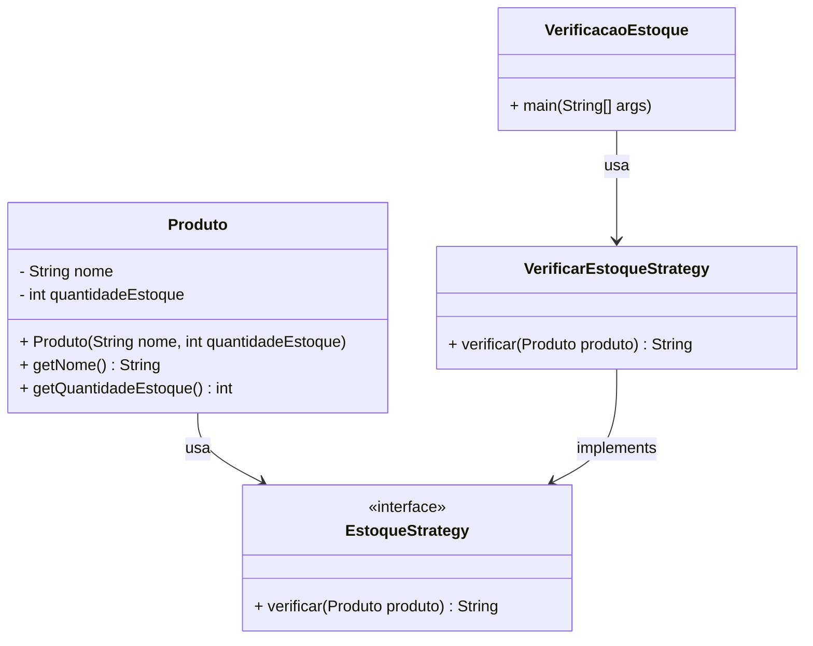

 Intermediate    Princípios Básicos
## Descrição


Você está desenvolvendo um programa para verificar o estoque de produtos, e este desafio visa aplicar o conceito de Clean Architecture para uma solução mais estruturada e modular. A Clean Architecture, desenvolvida por Robert C. Martin (também conhecido como Uncle Bob), é uma abordagem que separa as responsabilidades de um sistema em camadas distintas. Isso permite uma melhor organização do código e facilita a manutenção e a escalabilidade.

Para este desafio, seu objetivo é implementar a camada de Casos de Uso utilizando o padrão Strategy para a lógica de verificação de estoque. Você precisará garantir que o código esteja organizado conforme os princípios da Clean Architecture. Você precisará implementar uma classe chamada `VerificarEstoqueStrategy` que deve seguir uma interface denominada `EstoqueStrategy`. Esta classe será responsável por verificar o nível de estoque de um produto e gerar uma mensagem adequada com base nesse nível.

### Resumindo:

Você precisa implementar a classe `VerificarEstoqueStrategy` para:

- Implementar a interface `EstoqueStrategy`.
- Usar uma constante para definir o limite mínimo de estoque.
- Verificar a quantidade de estoque do produto e retornar uma mensagem apropriada com base nesse valor.

Saiba mais sobre: Clean Architecture
## Entrada

O programa deve receber as seguintes entradas:

    Nome do Produto: Uma string representando o nome do produto.

    Quantidade em Estoque: Um inteiro representando a quantidade atual em estoque do produto.

## Saída

    "Alerta: Estoque baixo de X", onde X é o nome do produto, se a quantidade em estoque for menor do que o limite mínimo pré-definido de 10 unidades.

    "Estoque de X esta em nivel adequado", onde X é o nome do produto, se a quantidade em estoque for igual ou maior que o limite mínimo pré-definido de 10 unidades.

>IMPORTANTE:
>
>É fundamental que as saídas/retornos estejam idênticas como o solicitado na descrição do desafio.
### Exemplos

A tabela abaixo apresenta exemplos com alguns dados de entrada e suas respectivas saídas esperadas. Certifique-se de testar seu programa com esses exemplos e com outros casos possíveis.
Entrada 	Saída
Teclado
8 	Alerta: Estoque baixo de Teclado
SSD
9 	Alerta: Estoque baixo de SSD
Placa Mae
25 	Estoque de Placa Mae esta em nivel adequado

### Explicação:
Classe `Produto`:
Esta classe representa um produto com um nome (nome) e uma quantidade em estoque (quantidadeEstoque).
Interface `EstoqueStrategy`:
Define a estratégia para verificar o estoque de um produto. Ela contém o método verificar que aceita um objeto do tipo Produto.
Classe `VerificarEstoqueStrategy`:
Esta classe implementa a interface EstoqueStrategy.
Ela contém uma constante `LIMITE_MINIMO` com o valor 10 para representar o limite mínimo de estoque.
O método `verificar` verifica se a quantidade de estoque é menor que o limite e retorna a mensagem apropriada.
Classe Principal `VerificacaoEstoque`:
Lê as informações do usuário (nome do produto e quantidade em estoque).
Cria um objeto `Produto` e utiliza a estratégia `VerificarEstoqueStrategy` para verificar o estoque.
Exibe a mensagem adequada conforme a quantidade de estoque.
#### Exemplos de Execução:
Entrada:
```bash
Teclado
8
```
Saída:

``` bash
Alerta: Estoque baixo de Teclado
```
Entrada:
``` bash
SSD
9
```
Saída:

``` bash
Alerta: Estoque baixo de SSD

```
Entrada:
```bash 
Placa Mae
25
```
Saída:
```bash 
Estoque de Placa Mae esta em nivel adequado
```
Com essa implementação, você está aplicando o padrão Strategy na camada de Casos de Uso, respeitando os princípios da Clean Architecture, o que permite que a lógica de verificação de estoque seja facilmente substituída ou alterada futuramente.

Diagrama de Classe:

### Explicação:
Produto: Classe com atributos nome e quantidadeEstoque, além dos métodos para obtê-los.
EstoqueStrategy: Interface que define o método verificar(Produto produto).
VerificarEstoqueStrategy: Classe que implementa a interface EstoqueStrategy e contém a lógica de verificação de estoque.
VerificacaoEstoque: Classe principal que utiliza a estratégia de verificação de estoque, chamando o método verificar da classe VerificarEstoqueStrategy.
Esse diagrama ilustra a relação entre as classes e interfaces, refletindo o padrão de design Strategy que foi implementado no código Java.
