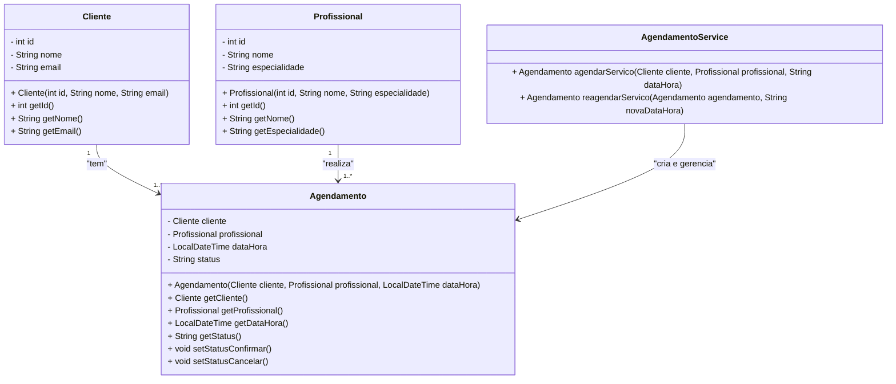

<div align="center">

<h1>Java</h1>

</div>


<h1 align="center"> Testes Unitários com JUnit </h1>


   


# Testes Unitários - ConfortAid Project

## Descrição do Projeto

Este projeto enfatiza práticas de desenvolvimento orientadas a testes, com uma cobertura significativa de testes unitários para garantir a confiabilidade e consistência das principais funcionalidades.Neste caso, focou-se nas funcionalidades de agendamento de serviços

## Estrutura do Projeto

A estrutura do projeto segue uma organização padrão para aplicações Spring Boot:
```
src/
├── main/
│   ├── java/
│   │   └── edu.ifsc.ConfortAid/
│   │       ├── domain/          # Modelos de dados (Agendamento, Cliente, Profissional)
│   │       ├── service/         # Serviços (Regras de negócio como agendamento e reagendamento)
│   │       └── controller/      # Controladores REST para a interação com o cliente
│   ├── resources/               # Arquivos de configuração (application.properties)
│
├── test/
│   ├── java/
│   │   └── edu.ifsc.ConfortAid/
│   │       └── CT001AgendamentoTest.java  # Testes unitários de agendamento
│   │       ├── CT002CancelamentoTest.java # Testes unitários de cancelamento
│   │       ├── CT003DataHoraInvalidaTest.java # Testes unitários de Datas invalidas
│   │       ├── CT004HorarioOcupadoTest.java # Testes unitários de cancelamento
│   │       ├── CT005ReagendamentoTest.java # Testes unitários de reagendamentos
│   └── resources/             # (Pasta de recursos para testes, atualmente não utilizada)
```

## Tecnologias Utilizadas

* Java 17: Linguagem principal.
* Spring Boot: Framework para desenvolvimento rápido e simplificado.
* JUnit 5: Biblioteca de testes para garantir a qualidade do código.
* Maven: Ferramenta de gerenciamento de dependências e build.

## Testes Unitários

Os testes unitários foram escritos com JUnit 5 e abrangem as seguintes funcionalidades principais:

1. __Criação de Agendamento__
   
   * _Descrição_: Valida a criação de um agendamento entre cliente e profissional, verificando os atributos configurados e o status inicial.
   * _Teste_: `CT001AgendamentoTest.testAgendamentoBemSucedido()`
   * __Cobertura__:
      * Cliente e profissional válidos.
      * Horário selecionado dentro das regras de negócio.
      * Confirmação do agendamento.
2. __Reagendamento de Serviços__
   
   * _Descrição_: Testa a funcionalidade de reagendamento, garantindo que:
     - Não é possível reagendar para uma data/hora já passada.
     - O horário está dentro do período de atendimento permitido.
     - Não há conflitos de horário com outros agendamentos do profissional.
   * _Teste_: `AgendamentoService.reagendarServico()`
   * __Cobertura__:
      * Validação de datas no passado.
      * Regras de horário de atendimento.
      * Verificação de horários já ocupados.
3. __Status do Agendamento__
   * _Descrição_: Verifica a alteração de status do agendamento (confirmado, cancelado, pendente).
   * _Teste_: `CT001AgendamentoTest.testAgendamentoBemSucedidoClassAgendamento()`
   * __Cobertura__:
       * Transições de status.
       * Validação de estados inválidos.
       * Execução dos Testes

## Diagrama de Classe



Explicação:

1. __Classes Principais__:
- `Cliente`, `Profissional` e `Agendamento` são as entidades principais do sistema.
- `AgendamentoService` contém a lógica de negócio para criação e gerenciamento de agendamentos.

2. __Relacionamentos__:
- `Cliente` e `Profissional` têm relações de "um para muitos" com `Agendamento`.
O `AgendamentoService` é usado para manipular as operações sobre os agendamentos.

## Pré-requisitos
1. JDK 17 instalado.
2. Maven configurado no ambiente.

### Passos para Executar os Testes
1. Certifique-se de estar na raiz do projeto.
2. Execute o seguinte comando:

    ```bash
    mvn test
    ```
3. Verifique o relatório de execução na saída do terminal.

## Considerações Finais

O projeto ConfortAid destaca-se pela organização e foco em testes para assegurar que as funcionalidades sejam confiáveis e atendam às expectativas dos usuários. A combinação de tecnologias modernas e boas práticas de desenvolvimento faz com que o código seja limpo, modular e fácil de manter.

Para contribuir ou relatar problemas, entre em contato pelo e-mail do autor ou abra uma issue no repositório.

# Author

| [<br><sub>Hayden Junior</sub>](https://github.com/JunhaumHayden) |
| :---: |
