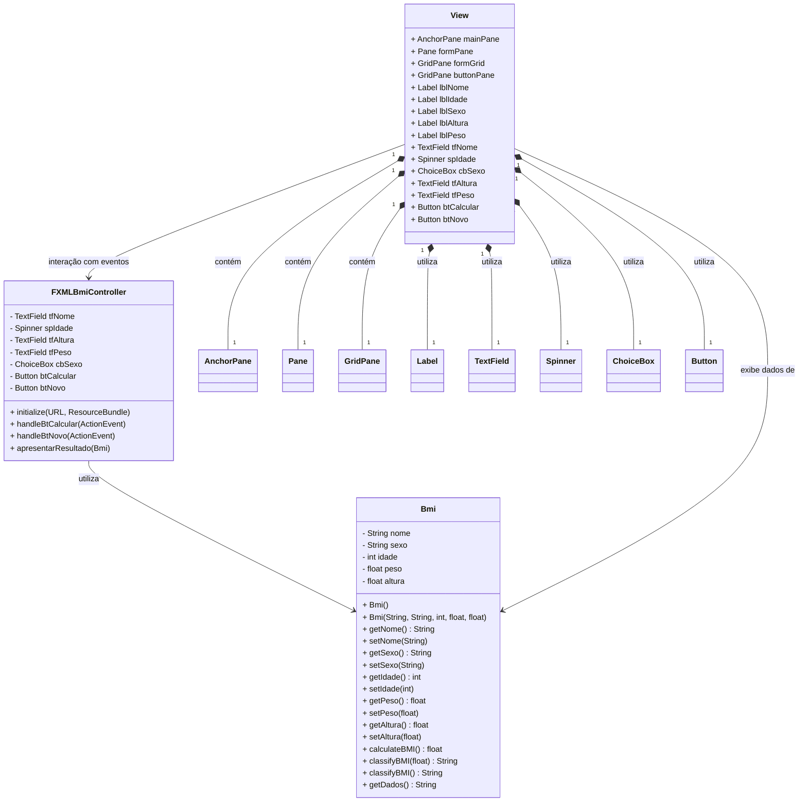

<div align="center">


</div>

###### #JavaCodes


<h1 align="center"> Calculadora de IMC com Java FX </h1>


<p align="center">

</p>

## Descrição:

# Calculadora de IMC (Índice de Massa Corporal)

Este projeto é uma aplicação JavaFX que calcula o Índice de Massa Corporal (IMC) de uma pessoa com base em suas informações pessoais, como nome, idade, sexo, altura e peso. O projeto segue o padrão de design **MVC (Model-View-Controller)**, garantindo uma separação clara entre lógica de negócios, interface de usuário e controle de interação.

## Funcionalidades

- **Calcular IMC**: Permite que o usuário insira suas informações (nome, idade, sexo, altura e peso) e, ao clicar em "Calcular", o aplicativo exibe o resultado do IMC e a classificação (e.g., Abaixo do Peso, Normal, Sobrepeso, Obesidade).
- **Limpar Campos**: Botão "Novo" para limpar os campos e preparar para uma nova entrada de dados.
- **Interface Gráfica**: Desenvolvida utilizando JavaFX, com layout definido no Scene Builder para uma experiência de usuário intuitiva.

## Tecnologias Utilizadas

- **Java**: Linguagem de programação principal para lógica e controle do aplicativo.
- **JavaFX**: Framework para construção da interface gráfica.
- **Scene Builder**: Ferramenta para criação e design de interfaces JavaFX.
- **Padrão MVC**: Implementação do padrão de design para separar responsabilidades.

## Estrutura do Projeto
```bash
src/
│
├── edu.ifsc.model/
│   └── Bmi.java           # Classe que representa os dados e a lógica do IMC
│
├── edu.ifsc.controller/
│   └── FXMLBmiController.java # Controlador que gerencia a interação entre a interface e a lógica de negócio
│
├── edu.ifsc.view/
│   └── main.fxml          # Layout da interface gráfica criado no Scene Builder
│
├── edu.ifsc.utils/
│   └── Utils.java         # Classe utilitária para operações adicionais
``` 

## Diagrama de Classe




## Classes Principais

### `Bmi` (Model)
Responsável por armazenar as informações do usuário e calcular o IMC com base na fórmula:

\[
IMC = \frac{peso}{altura^2}
\]


#### Atributos:
- `nome` (String)
- `sexo` (String)
- `idade` (int)
- `peso` (float)
- `altura` (float)

#### Métodos:
- `calculateBMI()`: Calcula o IMC.
- `classifyBMI()`: Retorna a classificação do IMC.
- `getDados()`: Formata e retorna uma string com as informações calculadas.

### `FXMLBmiController` (Controller)
Controlador responsável por gerenciar os eventos da interface. Ele coleta os dados do usuário, cria instâncias de `Bmi`, e exibe os resultados.

#### Métodos:
- `handleBtCalcular()`: Evento acionado ao clicar no botão "Calcular".
- `handleBtNovo()`: Evento acionado ao clicar no botão "Novo", limpando todos os campos.
- `apresentarResultado(Bmi)`: Exibe uma caixa de diálogo com o resultado do IMC.

### `FXMLCalculoIMC.fxml` (View)
Interface gráfica construída no Scene Builder, contendo campos para inserir as informações, botões para interação e layout organizado para facilitar a usabilidade.

## Pré-Requisitos

- **Java JDK 11+**
- **JavaFX SDK**
- **Scene Builder** (para modificar o layout da interface)

## Como Executar

1. Execute a classe `App` que é principal para iniciar a aplicação.
2. O projeto será montado e após será apresentado uma janela para interação com o usuário solicitando alguns dados.
3. Após a inserção de dados clicar no botão `calcular`.
4. Será apresentado uma nova janela com o resultado.

### Contribuições

Sinta-se à vontade para fazer fork do projeto e enviar pull requests com melhorias ou novas funcionalidades. Toda contribuição é bem-vinda!

Licença

Este projeto é licenciado sob a MIT License.


# Author

| [<br><sub>Carlos Hayden</sub>](https://github.com/JunhaumHayden) |
| :---: |