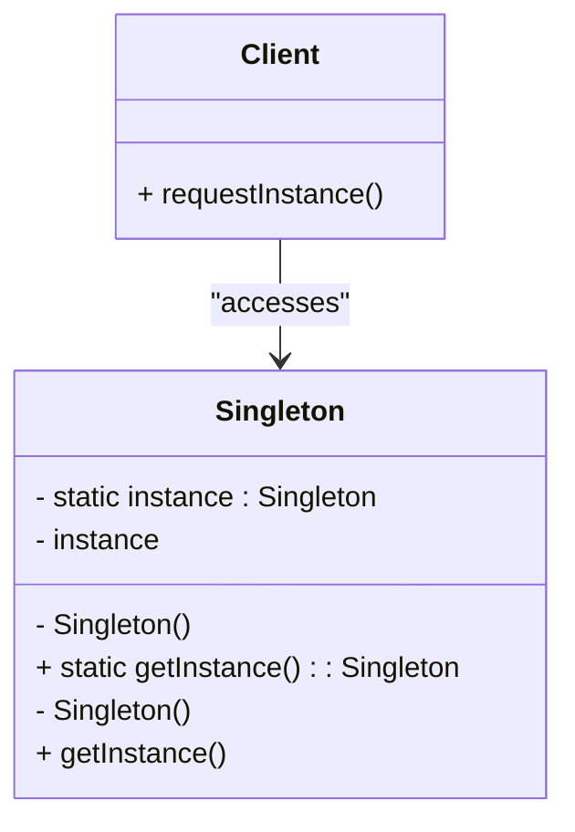
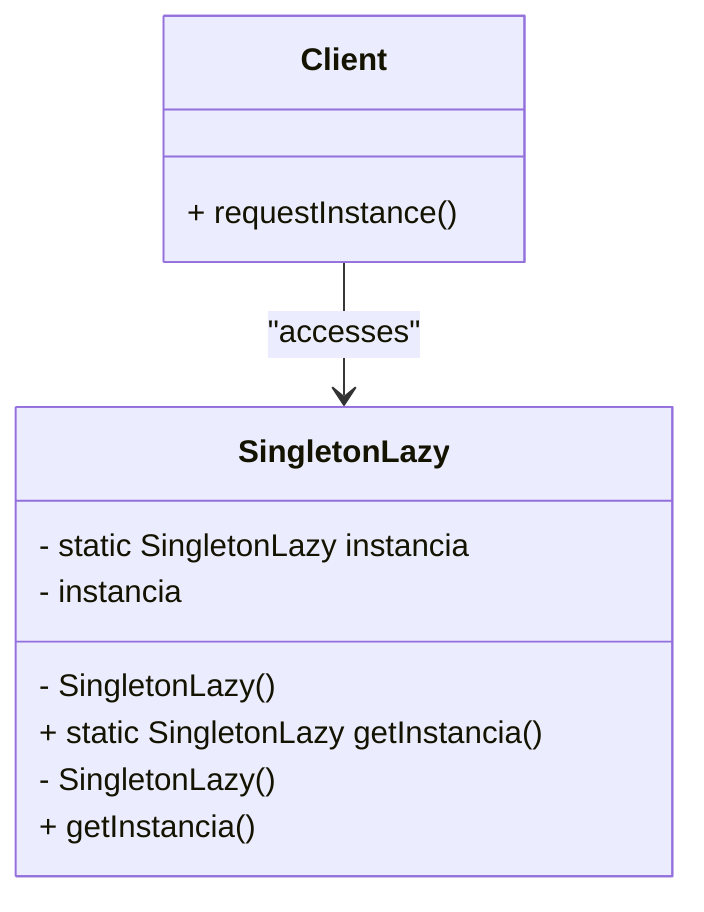
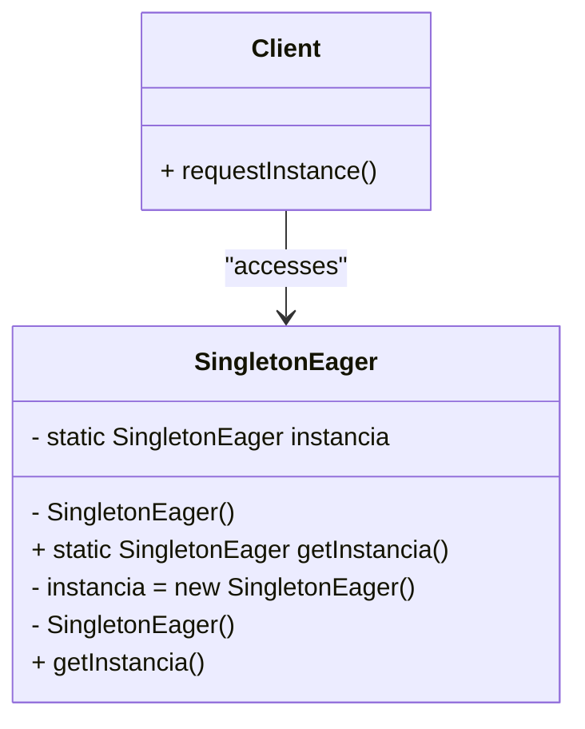
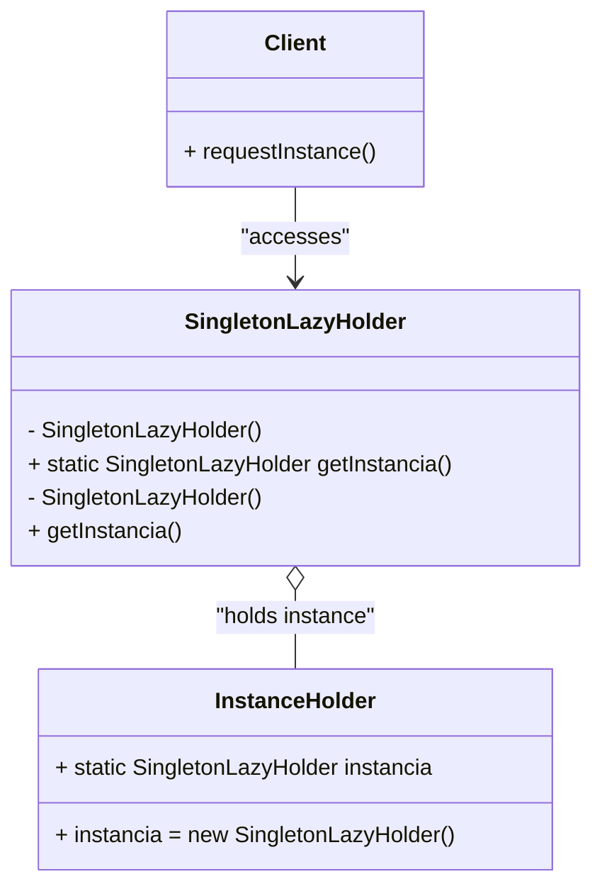
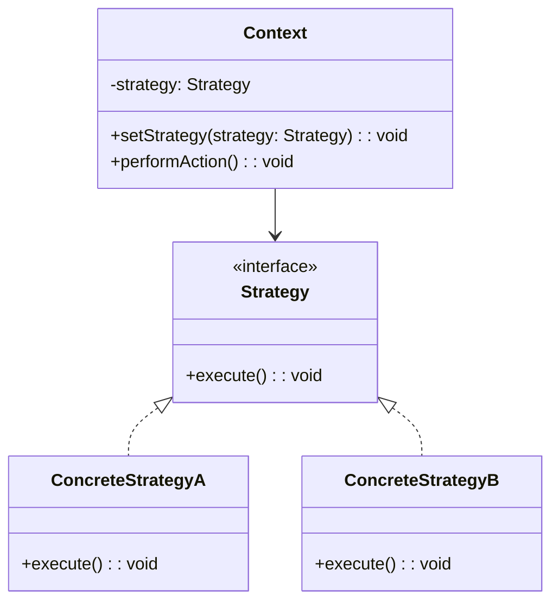
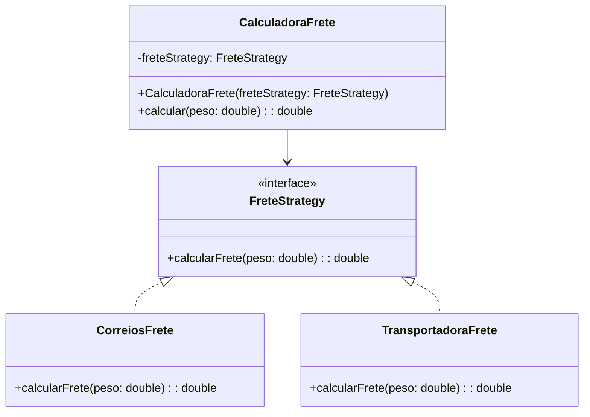
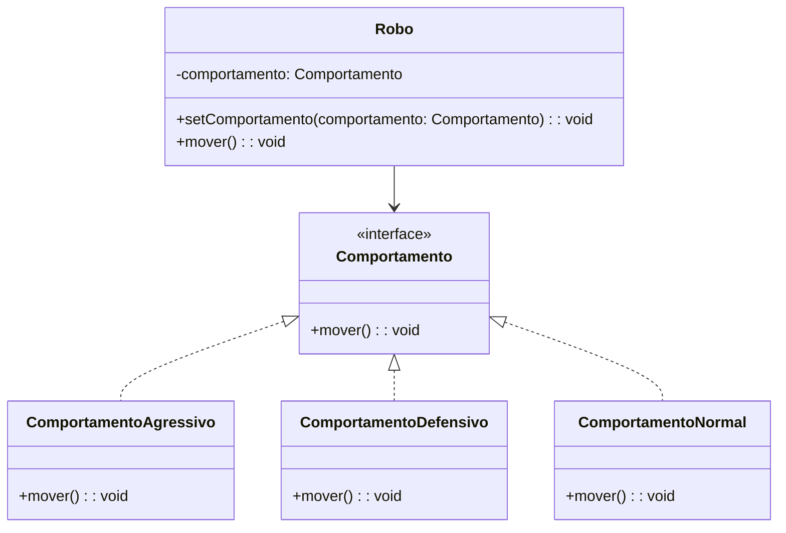

# Explorando Padrões de Projetos na Prática com Java

Repositório com as implementações dos padrões de projeto explorados no Lab "Explorando Padrões de Projetos na Prática com Java". Especificamente, este projeto explorou alguns padrões usando Java puro:
- Singleton
- Strategy
- Facade

## Padrão Singleton
O Singleton é um padrão de projeto criacional que tem como objetivo garantir que uma classe tenha apenas uma instância durante todo o ciclo de vida da aplicação e fornecer um ponto global de acesso a essa instância. Isso é útil em cenários onde é necessário controlar o acesso a um recurso compartilhado ou garantir um estado único em toda a aplicação.

Esse padrão é implementado restringindo o construtor da classe, tornando-o privado, e fornecendo um método público (geralmente chamado getInstance() ou getInstancia()) para retornar a instância única. Dependendo da necessidade, a instância pode ser criada de maneira preguiçosa (somente quando for solicitada pela primeira vez) ou apressada (instanciada no momento da inicialização da classe).


#### Exemplo de Uso
Um exemplo clássico de uso do padrão Singleton é no gerenciamento de conexões com um banco de dados:

_Cenário_:

Imagine que você está desenvolvendo uma aplicação que se comunica com um banco de dados. Criar uma nova conexão toda vez que a aplicação precisa acessar o banco seria ineficiente e custoso. O Singleton resolve esse problema garantindo que a aplicação use apenas uma única instância da classe responsável pela conexão com o banco de dados durante toda sua execução.

Exemplo de Código (Conexão com Banco de Dados):

```java
public class DatabaseConnection {

    private static DatabaseConnection instance;
    private Connection connection;

    private DatabaseConnection() {
        // Código para inicializar a conexão com o banco de dados
        String url = "jdbc:mysql://localhost:3306/meuBanco";
        String username = "root";
        String password = "123456";
        
        try {
            this.connection = DriverManager.getConnection(url, username, password);
        } catch (SQLException e) {
            throw new RuntimeException("Erro ao conectar ao banco de dados!", e);
        }
    }

    public static DatabaseConnection getInstance() {
        if (instance == null) {
            instance = new DatabaseConnection();
        }
        return instance;
    }

    public Connection getConnection() {
        return connection;
    }
}
``` 
Nesse exemplo, o Singleton garante que a classe DatabaseConnection só crie uma única conexão com o banco de dados, evitando sobrecarga e garantindo consistência durante toda a aplicação.

#### Exemplos de Implementação

> ⚠️ 🔭 Utilize a classe `Test.java` para verificar 


#### Explicação:
A classe `SingletonLazy` contém um atributo estático privado `instancia`, que armazena a única instância da classe.
O construtor é privado para garantir que a classe não seja instanciada diretamente fora dela.
O método `getInstancia()` verifica se a instância é nula e, se for, cria uma nova instância, retornando a instância existente caso contrário.


#### Explicação:
A classe `SingletonEager` cria a instância única da classe assim que ela é carregada, ou seja, a instância é criada imediatamente ao declarar a variável `instancia`.
O construtor é privado para evitar a criação de novas instâncias fora da classe.
O método `getInstancia()` simplesmente retorna a instância previamente criada.


#### Explicação:
A classe `SingletonLazyHolder` utiliza a abordagem "Holder" para carregar a instância preguiçosamente de maneira thread-safe.
A classe aninhada estática `InstanceHolder` contém a instância única de `SingletonLazyHolder`.
O método `getInstancia()` acessa a instância via `InstanceHolder`, garantindo que a instância só será criada quando o método for chamado pela primeira vez.

## Padrão Strategy
O Strategy é um padrão de projeto comportamental que permite definir uma família de algoritmos e torná-los intercambiáveis em tempo de execução. Ele encapsula cada algoritmo dentro de uma classe separada e permite que os objetos alterem seu comportamento sem modificar seu código. Isso promove o princípio de "abertura para extensão e fechamento para modificação", facilitando a manutenção e a escalabilidade do código.

Em vez de implementar todos os comportamentos diretamente dentro de uma única classe, o Strategy delega a responsabilidade para classes diferentes, cada uma implementando uma versão específica do comportamento desejado.




#### Exemplo de Uso
Um exemplo típico de uso do Strategy é em sistemas de cálculo de frete, onde o valor pode variar de acordo com a transportadora escolhida (Correios, transportadora privada, frete expresso, etc.).

_Cenário_:

Você está desenvolvendo um sistema de e-commerce que precisa calcular o frete de diferentes formas, dependendo da escolha do cliente. Ao invés de usar um grande bloco condicional (com if/else), você pode aplicar o padrão Strategy para encapsular os diferentes algoritmos de cálculo.

Exemplo de Código:



``` java

// Interface Strategy
public interface FreteStrategy {
    double calcularFrete(double peso);
}

// Implementação concreta do cálculo de frete para Correios
public class CorreiosFrete implements FreteStrategy {
    @Override
    public double calcularFrete(double peso) {
        return peso * 10.0; // Exemplo simples de cálculo
    }
}

// Implementação concreta do cálculo de frete para Transportadora privada
public class TransportadoraFrete implements FreteStrategy {
    @Override
    public double calcularFrete(double peso) {
        return peso * 15.0;
    }
}

// Contexto que utiliza a estratégia de frete
public class CalculadoraFrete {
    private FreteStrategy freteStrategy;

    public CalculadoraFrete(FreteStrategy freteStrategy) {
        this.freteStrategy = freteStrategy;
    }

    public double calcular(double peso) {
        return freteStrategy.calcularFrete(peso);
    }
}

// Uso do padrão Strategy
public class Main {
    public static void main(String[] args) {
        FreteStrategy freteCorreios = new CorreiosFrete();
        FreteStrategy freteTransportadora = new TransportadoraFrete();

        CalculadoraFrete calculadora = new CalculadoraFrete(freteCorreios);
        System.out.println("Frete Correios: " + calculadora.calcular(5));

        calculadora = new CalculadoraFrete(freteTransportadora);
        System.out.println("Frete Transportadora: " + calculadora.calcular(5));
    }
}
```

#### Exemplo de Implementaçao



_Descrição_:
Comportamento: Interface que define o método `mover()` para diferentes tipos de comportamento.
_ComportamentoAgressivo_, _ComportamentoDefensivo_, e _ComportamentoNormal_: Classes concretas que implementam a interface `Comportamento`, fornecendo diferentes implementações para o método `mover()`.
_Robo_: Classe que tem uma referência ao comportamento e delega a ação de `mover()` ao comportamento atual definido (É o contexto da aplicação). A função `setComportamento()` permite trocar dinamicamente o comportamento do robô.
>Essa estrutura ilustra como o padrão Strategy pode ser implementado para alterar dinamicamente o comportamento de uma classe (no caso, o robô) em tempo de execução.
